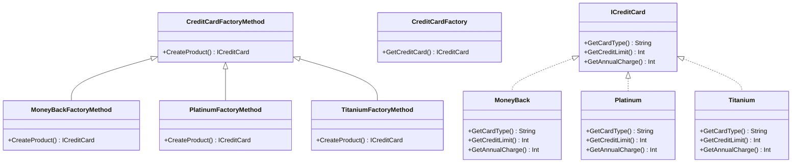

```mermaid
classDiagram

class CreditCardFactoryMethod
CreditCardFactoryMethod : +CreateProduct() ICreditCard

class CreditCardFactory
CreditCardFactory : +GetCreditCard() ICreditCard

class ICreditCard
ICreditCard : +GetCardType() String
ICreditCard : +GetCreditLimit() Int
ICreditCard : +GetAnnualCharge() Int

class MoneyBack
MoneyBack : +GetCardType() String
MoneyBack : +GetCreditLimit() Int
MoneyBack : +GetAnnualCharge() Int

class MoneyBackFactoryMethod
MoneyBackFactoryMethod : +CreateProduct() ICreditCard

class Platinum
Platinum : +GetCardType() String
Platinum : +GetCreditLimit() Int
Platinum : +GetAnnualCharge() Int

class PlatinumFactoryMethod
PlatinumFactoryMethod : +CreateProduct() ICreditCard

class Titanium
Titanium : +GetCardType() String
Titanium : +GetCreditLimit() Int
Titanium : +GetAnnualCharge() Int

class TitaniumFactoryMethod
TitaniumFactoryMethod : +CreateProduct() ICreditCard


ICreditCard <|.. MoneyBack
CreditCardFactoryMethod <|-- MoneyBackFactoryMethod
ICreditCard <|.. Platinum
CreditCardFactoryMethod <|-- PlatinumFactoryMethod
ICreditCard <|.. Titanium
CreditCardFactoryMethod <|-- TitaniumFactoryMethod

```
